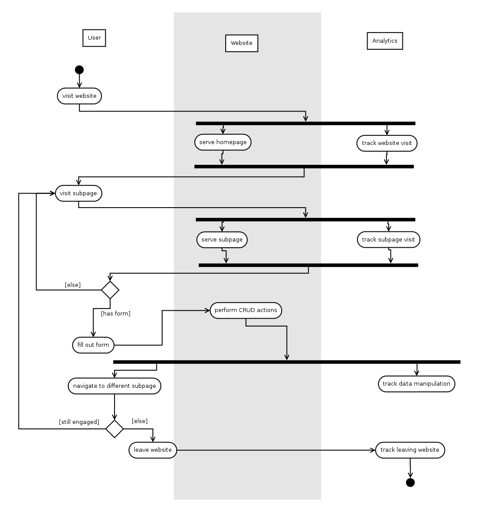
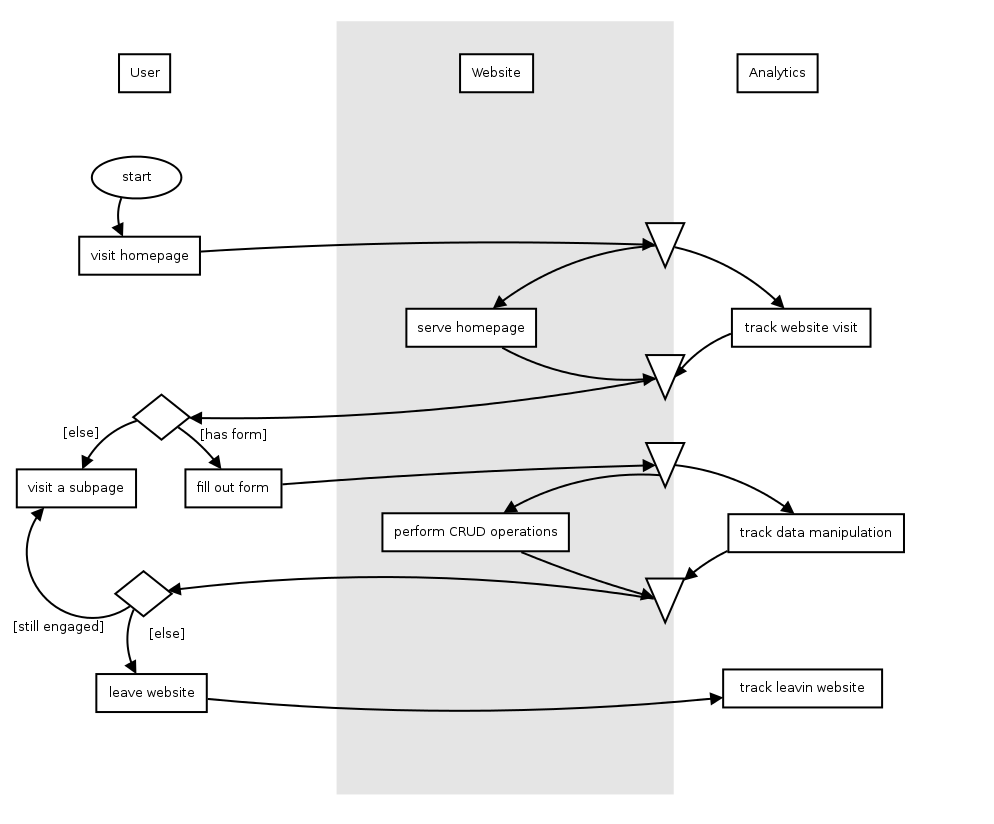
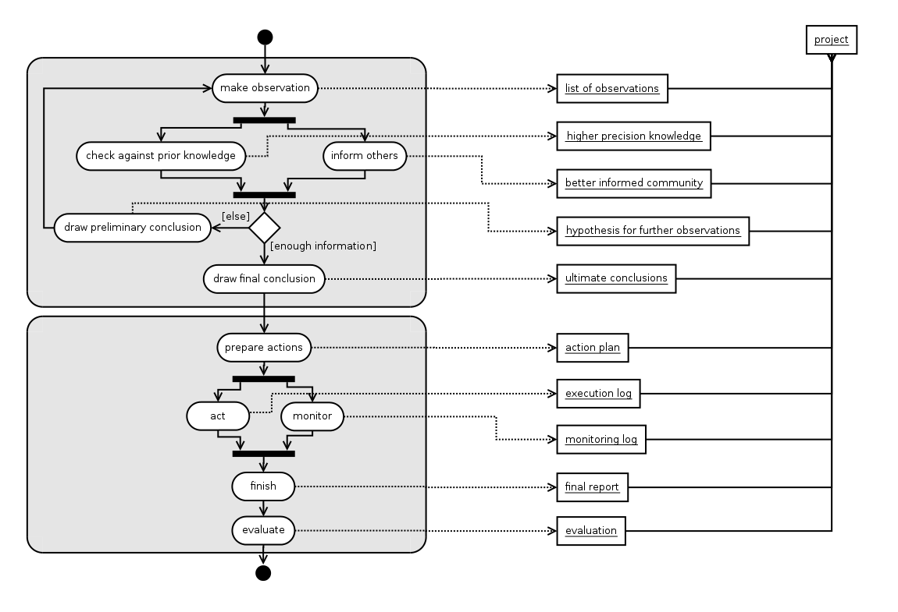
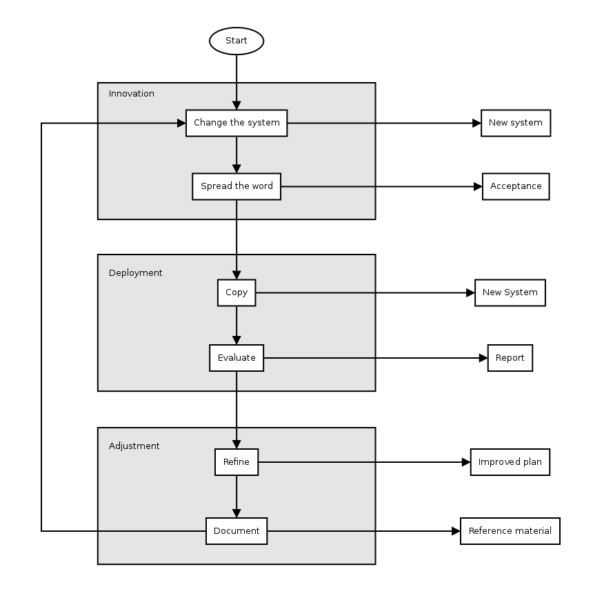
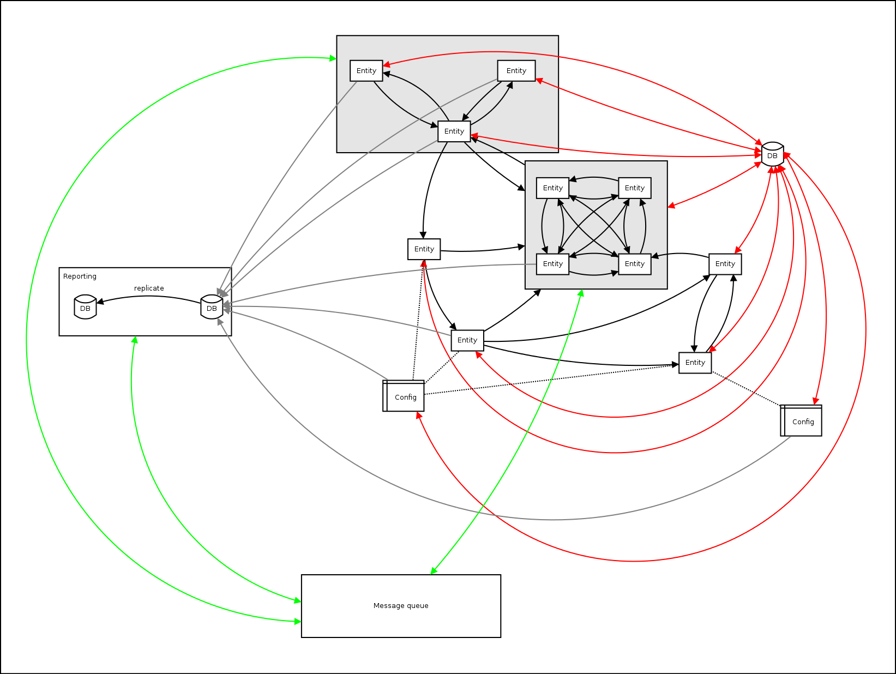

# Dia-grams

There are also

- [Technical Dia-grams](Technical.md)
- [Business Dia-grams](Business.md)
- [Art Dia-grams](Art.md)
- [Political Dia-grams](Political.md)
- [Scientific Dia-grams](Scientific.md)
- [Uncategorized Dia-grams](Uncategorized.md)

The following are some useful diagram layouts/structures.

**Activity Diagram**

**Activity Diagram 2**

**Activity Diagram 3**

**Innovation**

**Big Graph**

